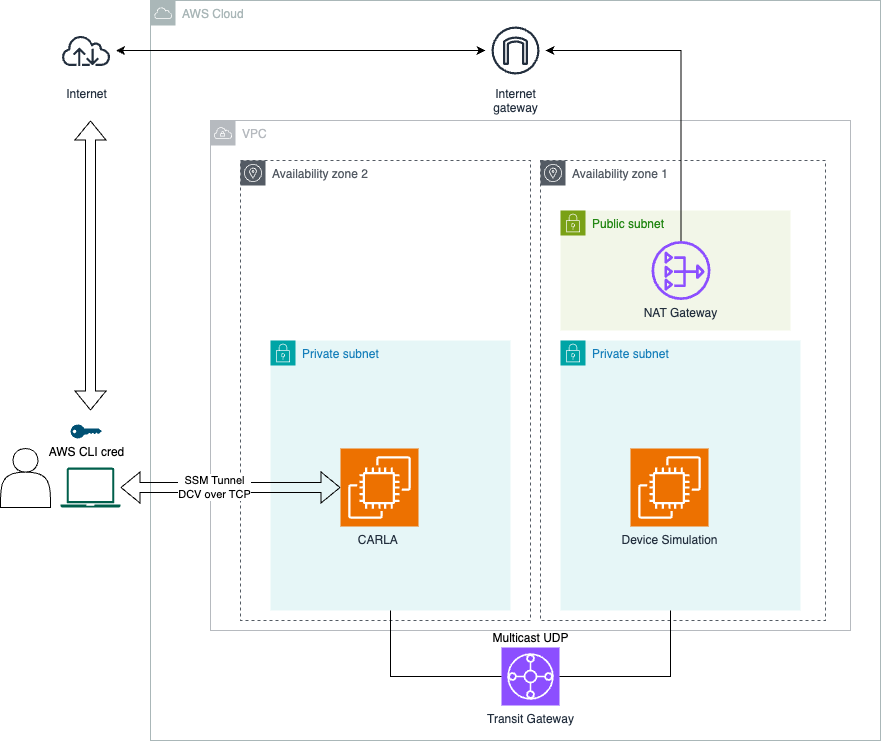
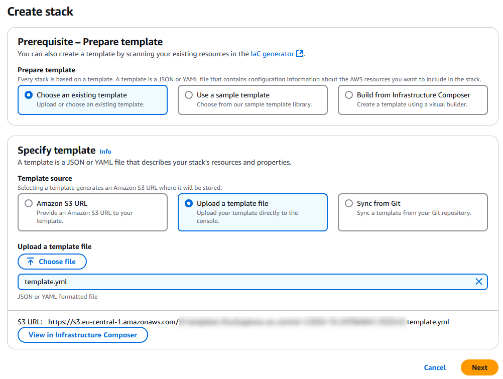
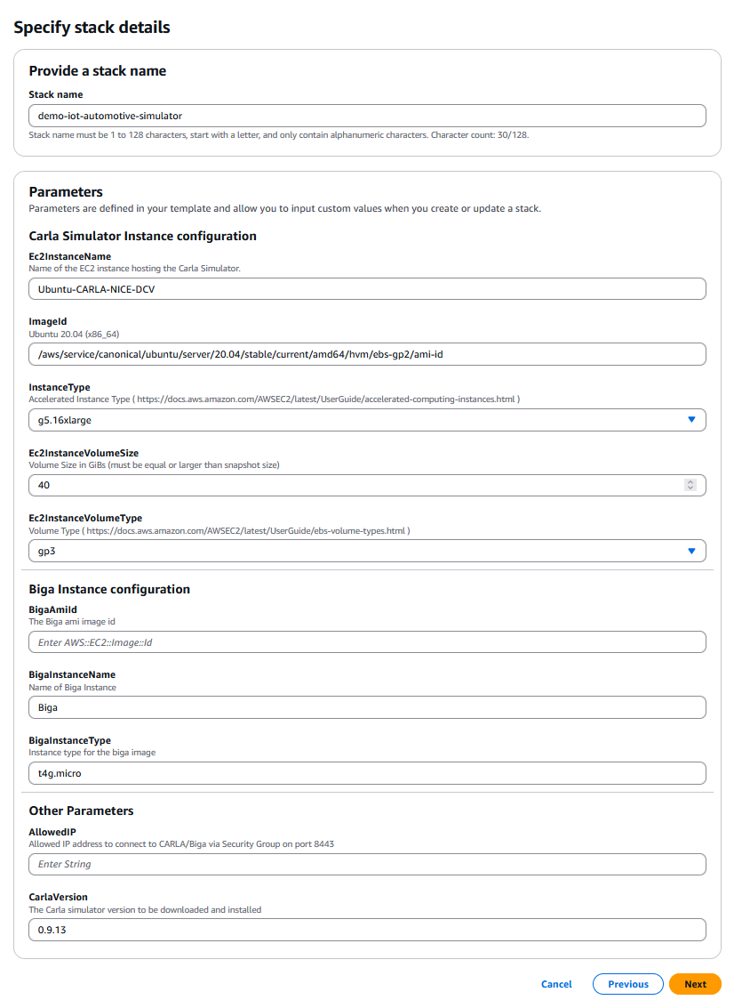
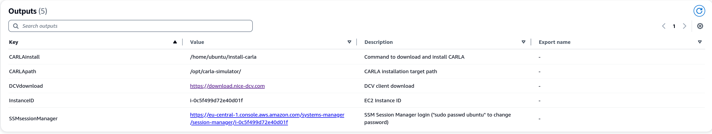
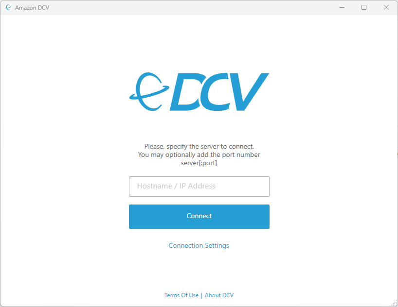
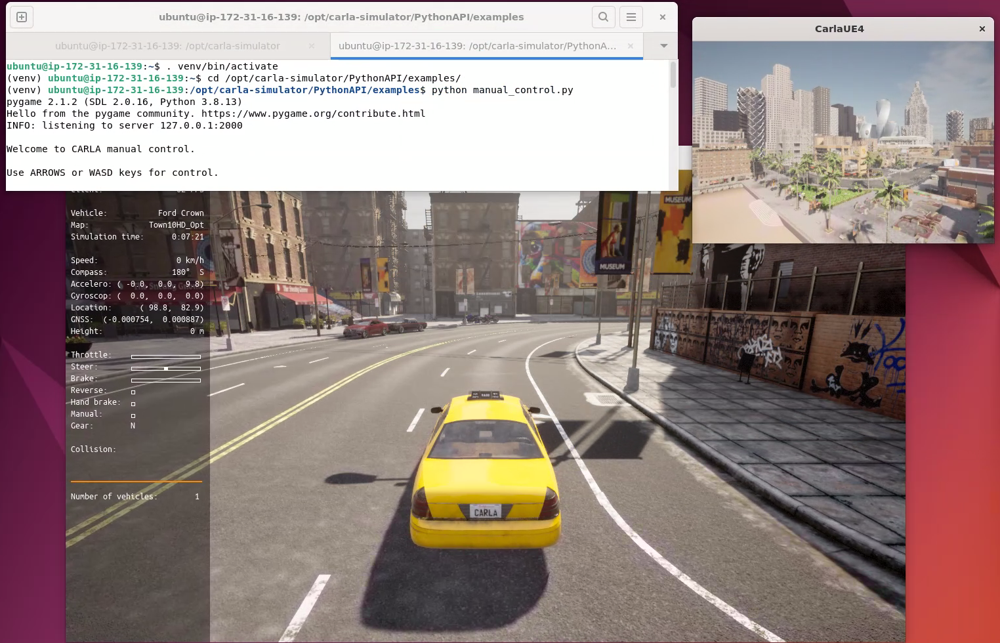

# CARLA Simulator Ubuntu 22.04 on Amazon EC2 + Amazon DCV + GPU

> If you are looking for instructions to setup this environment on a physical hardware, you can refer to the [manual install][./docs/manual-install.md] page.

## Table of Contents

1. [Introduction](#introduction)
1. [Deployment instructions](#deployment-instructions)
1. [Run the CARLA Simulator](#run-the-carla-simulator)
1. [Troubleshooting](#troubleshooting)
1. [Security](#security)
1. [License](#license)
1. [Credits](#credits)

## Introduction

This [AWS CloudFormation](https://aws.amazon.com/cloudformation/) template will deploy [CARLA Simulator](https://carla.org/) into an accelerated computing instance running the [NICE DCV](https://aws.amazon.com/hpc/dcv/) server.


### CARLA Simulator

CARLA is an open-source simulator for autonomous driving research to support the development, training, and validation of autonomous driving systems.

For more information about CARLA you can refere to : https://carla.org/ 

### Amazon DCV



NICE DCV is a high-performance remote display protocol that provides customers with a secure way to deliver remote desktops and application streaming from any cloud or data center to any device over varying network conditions.

For security reasons, the EC2 instance are located in a private subnet. Therefore, you will need to use the AWS systems manager with the [Session Manager plugin](https://docs.aws.amazon.com/systems-manager/latest/userguide/install-plugin-debian-and-ubuntu.html) to tunnel the DCV port to your local machine.

Once the tunnel is setup, the NICE DCV client can connect to the instance using ***localhost:8443***.

You will need to set the ***Connection Setting*** to be ***WebSockets/TCP*** instead of ***QUIC***.

>
>
> ### Amazon DCV with unicast
>
> Be aware that the unicast setup does not support UDP multicasting.
>
>To use the simplified architecture without Transit Gateway, follow these steps:
>
>1. Configure both the device simulator and CARLA for unicast when using ROS2.
>1. Find the example configuration for `cyclonedds` at: `carla-client/ros2/cyclonedds_unicast.yaml`.
>1. Before running the ROS2 example, set the `CYCLONEDDS_URI` environment variable with this command:
>  ```sh
>     export CYCLONEDDS_URI=carla-client/ros2/cyclonedds_unicast.yaml
>  ```
>4. use ***`template-unicast.yml`*** as a *CloudFormation* template instead of ***`template.yml`***

## Deployment instructions

### Prerequisites

In order to properly deploy the stack and access the environment, you will need to complete the following stpes on your local machine.

##### Setting environment variables

```bash
export AWS_PROFILE="riv24"
export AWS_DEFAULT_REGION=$(aws configure get region --profile ${AWS_PROFILE})
export AWS_DEFAULT_ACCOUNT=$(aws sts get-caller-identity --query Account --output text --profile ${AWS_PROFILE})
export AWS_DEFAULT_REGION=eu-central-1
```

#### Session Manager plugin

For security reasons, you need to use the AWS systems manager with the [Session Manager plugin](https://docs.aws.amazon.com/systems-manager/latest/userguide/install-plugin-debian-and-ubuntu.html) to tunnel the DCV port to your local machine.

for detailed installation instruction, please follow: https://docs.aws.amazon.com/systems-manager/latest/userguide/install-plugin-debian-and-ubuntu.html

#### Get the Biga AMI ID

In order to create the current stack, you will need to reference the AMI id created in the [demo-iot-automotive-embeddedlinux-image](https://github.com/aws4embeddedlinux/demo-iot-automotive-embeddedlinux-image) project.

So, if haven't deployed it yet, please proceed with the deployment of the [demo-iot-automotive-embeddedlinux-image](https://github.com/aws4embeddedlinux/demo-iot-automotive-embeddedlinux-image) project.

Once you have deployed the [demo-iot-automotive-embeddedlinux-image](https://github.com/aws4embeddedlinux/demo-iot-automotive-embeddedlinux-image) project, you will need to retrieve the AMI created by the **`EC2AMIBigaPipeline`** stack pipeline.

You can access it in the console via the EC2 console AMI list using the following url after replacing the `<region>` token:

```
https://<region>>.console.aws.amazon.com/ec2/home?Images:visibility=owned-by-me&region=<region>#Images:visibility=owned-by-me
```

Alternatively, you can execute the following script to retrieve the latest Biga AMI id:

> Make sure to replace the `<STACK_NAME>` token if you changed the deployed stack name from [demo-iot-automotive-embeddedlinux-image](https://github.com/aws4embeddedlinux/demo-iot-automotive-embeddedlinux-image).

```bash
# cat << 'EOF' > get-ami-id.sh
# #!/bin/bash

# STACK_NAME=EC2AMIBigaPipeline

# s3_bucket_arn=$(aws cloudformation describe-stacks --stack-name ${STACK_NAME} --output text --query "Stacks[0].Outputs[?OutputKey=='BuildOutput'].OutputValue")
# s3_bucket_name=${s3_bucket_arn##*:}
# ami_file=$(aws s3api list-objects --bucket $s3_bucket_name --output text --query 'Contents[?starts_with(Key, `ami`) == `true`][Key,LastModified] | sort_by(@, &[1])[1:][0]')
# ami_id=${ami_file%%.*}

# echo -e "${ami_id}"
# EOF
# chmod +x get-ami-id.sh

ami_id=$(aws ec2 describe-images \
    --region $AWS_DEFAULT_REGION \
    --owners self \
    --query 'Images[?contains(ImageLocation, `poky-agl-pike`) == `true`] | sort_by(@, &CreationDate) | [-1] | ImageId' \
    --output text)

echo -e "The Biga AMI ID is : $ami_id"
```

-----

### Deploying the CloudFormation Stack

Download the template file **[template.yml](template.yml)** (or **[template-unicast.yml](template-unicast.yml)** for the unicast option).

Login into the AWS [CloudFormation console](https://console.aws.amazon.com/cloudformation/home#/stacks/create/template).

Click on **Create Stack** the select **With new ressources (standard)**. 

Keep **Chooses an existing template** selected and then select **Upload a template file**.

Clicke on the **Choose file** button, a popup will appear to browse your local machine and select the CloudFormation template to be used.

Once the template is selected clicnk on **Next**.



Specify a **Stack name** like **`demo-iot-automotive-simulator`** and the following parameter values (all fields are required):

| Parameter Name       | Description | Default value |
|----------------------|-------------|---------------|
| **ImageId**          | [System Manager Parameter](https://aws.amazon.com/blogs/compute/using-system-manager-parameter-as-an-alias-for-ami-id/) path to AMI ID. | /aws/service/canonical/ubuntu/server/20.04/stable/current/amd64/hvm/ebs-gp2/ami-id
| **InstanceType**     | appropriate [instance type](https://docs.aws.amazon.com/AWSEC2/latest/UserGuide/instance-types.html). | g5.16xlarge | 
| **Ec2InstanceName**        | Name of the EC2 instance hosting the Carla Simulator. | Ubuntu-CARLA-DCV
| **Ec2InstanceVolumeType**  | EBS volume type. | gp3
| **Ec2InstanceVolumeSize**  | EBS volume size (in GB). | 40
| **BigaAmiId**              | AMI of the EC2 image for the Biga device as determined in [Get the Biga AMI ID](#get-the-biga-ami-id) | `specific to your current environment`
| **BigaInstanceType** | Instance type of the Biga device. | t4g.micro
| **BigaInstanceName** | Name of the Biga device. | Biga
| **AllowedIP** | an IP address CIDR range that will be allow listed to access the Carla Simulator via a security group rule |  `specific to your current environment`
| **CarlaVersion** | The carla simulator version to be installed | 0.9.13




Click on **Next** until you can to click **Submit** to launch the stack creation.

> It may take up to 60 minutes to provision the stack, which mostly due to the Carla instance creation where a series of softwares needs to be installed and configured. 

After your stack has been successfully created, its status changes to **CREATE\_COMPLETE**. 

Now, go to the **Outputs** tab.



### Get the Carla Simulator Ubuntu user password from AWS Secrets Manager

On the **Outputs** tab, locate the entry named **`CarlaSimulatorSecret`**.

You can now execute the following command to retrieve the Ubuntu user password stored in the secret:

```sh
STACK_NAME=demo-iot-automotive-simulator

secret_arn=$(aws cloudformation describe-stacks --stack-name ${STACK_NAME} --output text --query "Stacks[0].Outputs[?OutputKey=='CarlaSimulatorSecret'].OutputValue")

aws secretsmanager get-secret-value --secret-id $secret_arn --query 'SecretString' | jq -r '. | fromjson | .password'
```

### Access the Carla Simulator instance via AWS System Manager Session Manager

On the **Outputs** tab, locate the entry named **`SSMSessionManagerURL`** which contains the URL to log in via SSM Session Manager.

The URL should look like this : *`https://<region>.console.aws.amazon.com/systems-manager/session-manager/<instance id>`*

For more information, check the [AWS Systems Manager Session Manager](https://docs.aws.amazon.com/systems-manager/latest/userguide/session-manager.html) documentation.

### Access the Carla Simulator instance via Amazon DCV web browser client

The created stack will allow list your current IP address to connect into the resources associated with the public subnet and `BigaSecurityGroup` security group.

> If your IP address changes or you don't need to access the Carla Simulator instance, make sure to update the `BigaSecurityGroup` security group and update or remve the rule named `external access - tcp - 8443` & `external access - udp - 8443` .

On the **Outputs** tab, locate the entry named **`NICEDCVWebAccessConsoleURL`** which contains the URL to log in via SSM Session Manager.

The URL should look like this : *`https://<carla simulator pulic dns>:8443`*

For more information, check the [Amazon DCV Web browser client](https://docs.aws.amazon.com/dcv/latest/userguide/client-web.html) documentation.

### Access the Carla Simulator instance via the Amazon DCV client

Install the Amazon DCV client of you current operating system from the [Amazon DCV Dowloads](https://www.amazondcv.com/latest.html) page.

Once installed, start the Amazon DCV client :



From the **Outputs** tab in the CloudFormation stack, locate the entry named **`NICEDCVClientConnectionString`** and paste it in the Amazon DCV client.

The Amazon DCV client will allow more feature compare to the Amazon DCV web browser client.


[Bask to the top](#table-of-contents)

## Run the CARLA Simulator with manual control and no CAN integration

Now, you can start driving !!! 

In order to do so, you will have to follow the steps below:

- Open an Amazon DCV session (either through the web client or the locl client)
- Open a new terminal as the biga user and execute the following command:

    ```sh
    source ~/venv/bin/activate
    /opt/carla-simulator/CarlaUE4.sh -no-rendering -quality-level=Epic -prefernvidia
    ```

- Open a new terminal as the biga user and execute the following commands:

    ```sh
    source ~/venv/bin/activate
    cd /opt/carla-simulator/PythonAPI/examples
    python manual_control.py
    ```



You can use the arrow to control the car.

Here is the keyboard mapping for the car:

```
    W            : throttle
    S            : brake
    A/D          : steer left/right
    Q            : toggle reverse
    Space        : hand-brake
    P            : toggle autopilot
    M            : toggle manual transmission
    ,/.          : gear up/down
    CTRL + W     : toggle constant velocity mode at 60 km/h

    L            : toggle next light type
    SHIFT + L    : toggle high beam
    Z/X          : toggle right/left blinker
    I            : toggle interior light

    TAB          : change sensor position
    ` or N       : next sensor
    [1-9]        : change to sensor [1-9]
    G            : toggle radar visualization
    C            : change weather (Shift+C reverse)
    Backspace    : change vehicle

    O            : open/close all doors of vehicle
    T            : toggle vehicle's telemetry

    V            : Select next map layer (Shift+V reverse)
    B            : Load current selected map layer (Shift+B to unload)

    R            : toggle recording images to disk

    CTRL + R     : toggle recording of simulation (replacing any previous)
    CTRL + P     : start replaying last recorded simulation
    CTRL + +     : increments the start time of the replay by 1 second (+SHIFT = 10 seconds)
    CTRL + -     : decrements the start time of the replay by 1 second (+SHIFT = 10 seconds)

    F1           : toggle HUD
    H/?          : toggle help
    ESC          : quit
```

## Run the CARLA Simulator with manual control and with CAN integration

In a new terminal as your target user, execute the following commands:

```sh
source ~/venv/bin/activate
cd ~/demo-iot-automotive-simulator
./start.sh -i vcan0
```

## Troubleshooting 

### Testing vCan connection to Biga EC2 instance

Open [EC2 console ](https://console.aws.amazon.com/ec2/home?#Instances:instanceState=running).

Select the instance named **Biga**, then click on **Connect**.

Select the **EC2 Serial Console** tab and click on **Connect**. 

> You might be required to activate activate the EC2 Serial Console in your account before being able to use it

In the **EC2 Serial Console** terminal for the **Biga** instance, execute the following command:

```sh
candump vcan0
```

Now connect to the **Ubuntu-CARLA-DCV** using **SSM Session Manager** or via **Amazon DCV**.

> To connect via **SSM Session Manager** , you can either use the link from the CloudFormation stack ouput or use the [EC2 console ](https://console.aws.amazon.com/ec2/home?#Instances:instanceState=running) **Connect** button.

In the terminal for the **Ubuntu-CARLA-DCV** instance, execute the following commands:

```sh
cd /home/ubuntu/Desktop/demo-iot-automotive-simulator
./multicast_can_send.sh &
cansend vcan0 123#00FFAA5501020304
```

Switch back to **EC2 Serial Console** terminal for the **Biga** instance where you should see the following :

```
root@ip-xxxxxxxxxxx:~# candump vcan0
vcan0  123   [8]  00 FF AA 55 01 02 03 04
```

You now use "ctrl-c" to exit from the candump.

[Bask to the top](#table-of-contents)

## Security

See [CONTRIBUTING](CONTRIBUTING.md#security-issue-notifications) for more information.

## License

This library is licensed under the MIT-0 License. See the LICENSE file.

## Credits

This AWS CloudFormation template has been made possible by using as a reference the [Amazon EC2 NICE DVC Samples](https://github.com/aws-samples/amazon-ec2-nice-dcv-samples).

[Bask to the top](#table-of-contents)