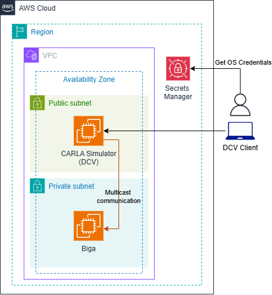
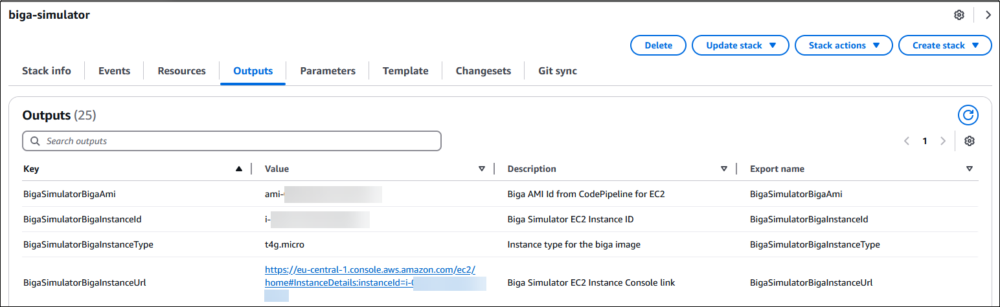
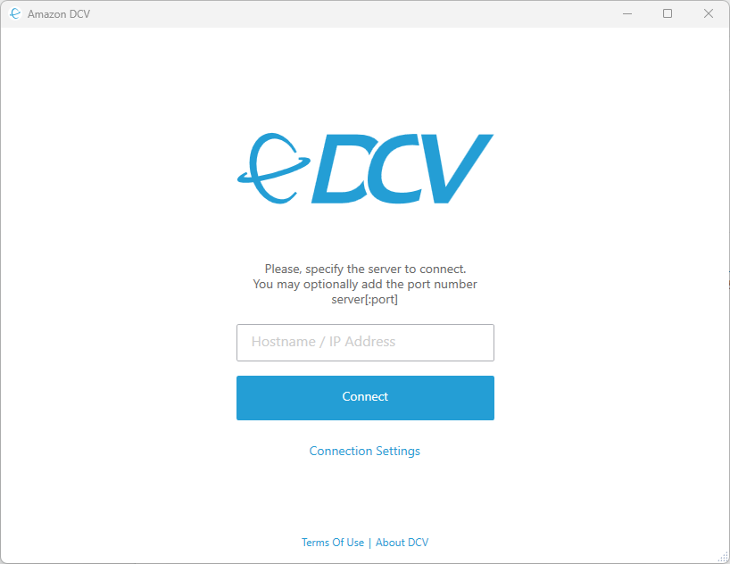

# CARLA Simulator Ubuntu 22.04 on Amazon EC2 + Amazon DCV + GPU

> If you are looking for instructions to setup this environment on a physical hardware, you can refer to the [manual install][./docs/manual-install.md] page.

## Table of Contents

1. [Introduction](#introduction)
1. [Deployment instructions](#deployment-instructions)
1. [Run the CARLA Simulator](#run-the-carla-simulator)
1. [Troubleshooting](#troubleshooting)
1. [Security](#security)
1. [License](#license)
1. [Credits](#credits)

## Introduction

This [AWS CloudFormation](https://aws.amazon.com/cloudformation/) template will deploy [CARLA Simulator](https://carla.org/) into an accelerated computing instance running the [NICE DCV](https://aws.amazon.com/hpc/dcv/) server.


### CARLA Simulator

CARLA is an open-source simulator for autonomous driving research to support the development, training, and validation of autonomous driving systems.

For more information about CARLA you can refere to : https://carla.org/ 

### Amazon DCV



NICE DCV is a high-performance remote display protocol that provides customers with a secure way to deliver remote desktops and application streaming from any cloud or data center to any device over varying network conditions.

For security reasons, the EC2 instance are located in a private subnet. Therefore, you will need to use the AWS systems manager with the [Session Manager plugin](https://docs.aws.amazon.com/systems-manager/latest/userguide/install-plugin-debian-and-ubuntu.html) to tunnel the DCV port to your local machine.

Once the tunnel is setup, the NICE DCV client can connect to the instance using ***localhost:8443***.

You will need to set the ***Connection Setting*** to be ***WebSockets/TCP*** instead of ***QUIC***.

>
>
> ### Amazon DCV with unicast
>
> Be aware that the unicast setup does not support UDP multicasting.
>
>To use the simplified architecture without Transit Gateway, follow these steps:
>
>1. Configure both the device simulator and CARLA for unicast when using ROS2.
>1. Find the example configuration for `cyclonedds` at: `carla-client/ros2/cyclonedds_unicast.yaml`.
>1. Before running the ROS2 example, set the `CYCLONEDDS_URI` environment variable with this command:
>  ```sh
>     export CYCLONEDDS_URI=carla-client/ros2/cyclonedds_unicast.yaml
>  ```
>4. use ***`template-unicast.yml`*** as a *CloudFormation* template instead of ***`template.yml`***

## Deployment instructions

### Prerequisites

This is the list of pre requisites for completing the installation and deployment:

- [AWS CLI](https://docs.aws.amazon.com/cli/latest/userguide/getting-started-install.html)
- [AWS CDK CLI](https://docs.aws.amazon.com/cdk/v2/guide/getting_started.html)
- [Node.js and NPM](https://docs.npmjs.com/downloading-and-installing-node-js-and-npm)
- OS Packages 
  - Zip & Unzip
  - jq

##### Setting environment variables

```bash
export AWS_PROFILE="default"
export AWS_DEFAULT_ACCOUNT=$(aws sts get-caller-identity --query Account --output text --profile ${AWS_PROFILE})
export AWS_DEFAULT_REGION=$(aws configure get region --profile ${AWS_PROFILE})

echo "PROFILE : $AWS_PROFILE"
echo "ACCOUNT : $AWS_DEFAULT_ACCOUNT"
echo "REGION  : $AWS_DEFAULT_REGION"
```

### Clone the project

```bash
git clone https://github.com/aws4embeddedlinux/demo-iot-automotive-simulator.git
cd demo-iot-automotive-simulator
```

### Bootstrap CDK

> [!NOTE]
> Only required once unless you upgrade your cdk version

```bash
cdk bootstrap aws://$AWS_DEFAULT_ACCOUNT/$AWS_DEFAULT_REGION
```

### Install packages and build the stack

First move to the `cdk` folder:
 
```bash
cd cdk
```

Then you will need to install the CDK library including the `aws4embeddedlinux-ci` library either using `yarn`:

```bash
yarn install
yarn build
```

> If you are not familliar with Yarn, please refer to the [documentation](https://yarnpkg.com/getting-started).

> [!NOTE]
>
> While the CDK projects often do not require that you invoke the build command separately, doing so will ensure various assets in the library are packaged correctly.

#### Biga AMI ID

In order to create the current stack, the CDP app needs to reference the AMI id created in the [demo-iot-automotive-embeddedlinux-image](https://github.com/aws4embeddedlinux/demo-iot-automotive-embeddedlinux-image) project.

So, if haven't deployed it yet, please proceed with the deployment of the [demo-iot-automotive-embeddedlinux-image](https://github.com/aws4embeddedlinux/demo-iot-automotive-embeddedlinux-image) project.

Once you have deployed the [demo-iot-automotive-embeddedlinux-image](https://github.com/aws4embeddedlinux/demo-iot-automotive-embeddedlinux-image) project, the CDK stack will search for an AMI with a tag Naem equal to `biga-ci-pipeline-ec2` (the name of the CodePipeline deployed by [demo-iot-automotive-embeddedlinux-image](https://github.com/aws4embeddedlinux/demo-iot-automotive-embeddedlinux-image) project) and an AMI name starting with `aws-biga-image-aws-ec2-arm64` .

If you need to reference a different Biga AMI, please upadte the `bigaMachineImage` variable at line `50` in `[cdk/bin/biga-simulator.ts](cdk/bin/biga-simulator.ts)`.


#### Stack Parameters

You can adjust additional stack parameter in `[cdk/bin/biga-simulator.ts](cdk/bin/biga-simulator.ts)` to customize your deployment.

The following parameter are available as CDK Stack Props passed to `BigaSimulatorStack` stack:

| Parameter Name       | Description | Default value |
|----------------------|-------------|---------------|
| **resourcePrefix**   | a prefix used to create resources| `biga-simulator`
| **allowedCIDR**       | an IP address CIDR range that will be allow listed to access the Carla Simulator via a security group rule |  your current IP address
| **useMultiCast**             | a flag that determine is Multicast will be configured
| **bigaInstanceType**  | Instance type of the Biga device. | t4g.micro
| **bigaMachineImage**  | a CDK EC2 IMachineImage object representing the Carla Simulator EC2 AMI image | use an AMI catalog lookup with AMI name and Name tag
| **carlaInstanceType**        | Instance type of the Carla Simulator EC2 instance. | g5.16xlarge
| **carlaInstanceVolumeSize**  | EBS volume size (in GB). | 40`
| **carlaMachineImage**        | a CDK EC2 IMachineImage object representing the Carla Simulator EC2 AMI image | use the SSM Parameter lookup for `/aws/service/canonical/ubuntu/server/20.04/stable/current/amd64/hvm/ebs-gp2/ami-id`
| **carlaOSUserName**          | the Carla Simulator OS user name| `biga`
| **carlaVersion**             | The carla simulator version to be installed | 0.9.13

-----

### Deploy the CDK stack

To deploy the CDK stack, you can use the following CDK deploy command:

```bash
cdk deploy  \
  --all  \
  --require-approval never \
  --no-rollback
```

> It may take up to 60 minutes to provision the stack, which mostly due to the Carla instance creation process where a series of softwares needs to be installed and configured. 

> Here we use the `--no-rollback` flag to avoid deleting resources in case of EC2 instances capacity issues for the Carla instance
>

After your CDK stack has been successfully created, you can go to the [CloudFormation Outputs](https://eu-central-1.console.aws.amazon.com/cloudformation/home?#/stacks?filteringText=biga-simulator&filteringStatus=active&viewNested=true) tab where you will find the details to connect to your environement.



### Cleanup

To remove all the resources associated with this application:

```bash
cdk destroy --all --force
```

### Get the Carla Simulator Ubuntu user password from AWS Secrets Manager

On the [CloudFormation Outputs](https://eu-central-1.console.aws.amazon.com/cloudformation/home?#/stacks?filteringText=biga-simulator&filteringStatus=active&viewNested=true) tab, locate the entry named **`CarlaSimulatorSecret`** (you can filter the list).

You can also execute the following commands to retrieve the Carla Simulator Ubuntu user & password stored in the secret:

```sh
STACK_NAME=biga-simulator

secret_id=$(aws cloudformation describe-stacks --stack-name ${STACK_NAME} --output text --query "Stacks[0].Outputs[?OutputKey=='BigaSimulatorCarlaSecretsName'].OutputValue")

cat << EOF
Carla Simulator credentials 
 - User Name : $(aws secretsmanager get-secret-value --secret-id $secret_id --query 'SecretString' | jq -r '. | fromjson | .username')
 - Password  : $(aws secretsmanager get-secret-value --secret-id $secret_id --query 'SecretString' | jq -r '. | fromjson | .password')
EOF
```

### Access the Carla Simulator instance via AWS System Manager Session Manager

On the **Outputs** tab, locate the entry named **`BigaSimulatorCarlaSsmSessionManagerUrl`** which contains the URL to log in via SSM Session Manager.

The URL should look like this : *`https://<region>.console.aws.amazon.com/systems-manager/session-manager/<instance id>`*

You can also execute the following commands to retrieve the information:

```sh
STACK_NAME=biga-simulator

cat << EOF
AWS System Manager Session Manager for Carla Simulator/
 $(aws cloudformation describe-stacks --stack-name ${STACK_NAME} --output text --query "Stacks[0].Outputs[?OutputKey=='BigaSimulatorCarlaSsmSessionManagerUrl'].OutputValue")
EOF
```

For more information, check the [AWS Systems Manager Session Manager](https://docs.aws.amazon.com/systems-manager/latest/userguide/session-manager.html) documentation.

### Access the Carla Simulator instance via Amazon DCV web browser client

The created stack will allow list your current IP address to connect into the resources associated with the public subnet and `BigaSecurityGroup` security group.

> If your IP address changes or you don't need to access the Carla Simulator instance, make sure to update the `biga-simulator-vpc-sg` security group and update or remve the rule named `external access - tcp - 8443` & `external access - udp - 8443` .

On the **Outputs** tab, locate the entry named **`BigaSimulatorNiceDcvClientWebConsoleUrl`** which contains the URL to log in via SSM Session Manager.

The URL should look like this : *`https://<carla simulator pulic dns>:8443`*

You can also execute the following commands to retrieve the information:

```sh
STACK_NAME=biga-simulator

cat << EOF
Amazon DCV web browser client for Carla Simulator/
 $(aws cloudformation describe-stacks --stack-name ${STACK_NAME} --output text --query "Stacks[0].Outputs[?OutputKey=='BigaSimulatorNiceDcvClientWebConsoleUrl'].OutputValue")
EOF
```

For more information, check the [Amazon DCV Web browser client](https://docs.aws.amazon.com/dcv/latest/userguide/client-web.html) documentation.

### Access the Carla Simulator instance via the Amazon DCV client

Install the Amazon DCV client of you current operating system from the [Amazon DCV Dowloads](https://www.amazondcv.com/latest.html) page.

Once installed, start the Amazon DCV client :



From the **Outputs** tab in the CloudFormation stack, locate the entry named **`NICEDCVClientConnectionString`** and paste it in the Amazon DCV client.

The Amazon DCV client will allow more feature compare to the Amazon DCV web browser client.

[Bask to the top](#table-of-contents)

## Run the CARLA Simulator with manual control and no CAN integration

Now, you can start driving !!! 

In order to do so, you will have to follow the steps below:

- Open an Amazon DCV session (either through the web client or the locl client)
- Open a new terminal as the biga user and execute the following command:

    ```sh
    source ~/.venv-carla/bin/activate
    /opt/carla-simulator/CarlaUE4.sh -no-rendering -quality-level=Epic -prefernvidia
    ```

- Open a new terminal as the biga user and execute the following commands:

    ```sh
    source ~/.venv-carla/bin/activate
    cd /opt/carla-simulator/PythonAPI/examples
    python manual_control.py
    ```


You can use the arrow to control the car.

Here is the keyboard mapping for the car:

```txt
    W            : throttle
    S            : brake
    A/D          : steer left/right
    Q            : toggle reverse
    Space        : hand-brake
    P            : toggle autopilot
    M            : toggle manual transmission
    ,/.          : gear up/down
    CTRL + W     : toggle constant velocity mode at 60 km/h

    L            : toggle next light type
    SHIFT + L    : toggle high beam
    Z/X          : toggle right/left blinker
    I            : toggle interior light

    TAB          : change sensor position
    ` or N       : next sensor
    [1-9]        : change to sensor [1-9]
    G            : toggle radar visualization
    C            : change weather (Shift+C reverse)
    Backspace    : change vehicle

    O            : open/close all doors of vehicle
    T            : toggle vehicle telemetry

    V            : Select next map layer (Shift+V reverse)
    B            : Load current selected map layer (Shift+B to unload)

    R            : toggle recording images to disk

    CTRL + R     : toggle recording of simulation (replacing any previous)
    CTRL + P     : start replaying last recorded simulation
    CTRL + +     : increments the start time of the replay by 1 second (+SHIFT = 10 seconds)
    CTRL + -     : decrements the start time of the replay by 1 second (+SHIFT = 10 seconds)

    F1           : toggle HUD
    H/?          : toggle help
    ESC          : quit
```

## Run the CARLA Simulator with manual control and with CAN integration

In a new terminal as your target user, execute the following commands:

```sh
source ~/.venv-carla/bin/activate
cd /opt/simulator-config
./start.sh -i vcan0
```

## Troubleshooting 

### Testing vCan connection to Biga EC2 instance

Open [EC2 console ](https://console.aws.amazon.com/ec2/home?#Instances:instanceState=running).

Select the instance named **biga-simulator-instance-biga**, then click on **Connect**.

Select the **EC2 Serial Console** tab and click on **Connect**. 

> You might be required to activate the EC2 Serial Console in your account before being able to use it

In the **EC2 Serial Console** terminal for the **Biga** instance, execute the following command:

```sh
candump vcan0
```

Now connect to the **biga-simulator-instance-carla** using **SSM Session Manager** or via **Amazon DCV**.

> To connect via **SSM Session Manager** , you can either use the link from the CloudFormation stack ouput or use the [EC2 console](https://console.aws.amazon.com/ec2/home?#Instances:instanceState=running) **Connect** button.

In a terminal for the **biga-simulator-instance-carla** instance, execute the following commands:

```sh
cd /opt/simulator-config
nohup ./vcan_send.sh &
echo $! > vcan_send.pid

cansend vcan0 123#00FFAA5501020304

kill -9 `cat vcan_send.pid`
rm vcan_send.pid
```

Switch back to **EC2 Serial Console** terminal for the **Biga** instance where you should see the following :

```
root@ip-xxxxxxxxxxx:~# candump vcan0
vcan0  123   [8]  00 FF AA 55 01 02 03 04
```

[Bask to the top](#table-of-contents)

## Security

See [CONTRIBUTING](CONTRIBUTING.md#security-issue-notifications) for more information.

## License

This library is licensed under the MIT-0 License. See the LICENSE file.

## Credits

This AWS CloudFormation template has been made possible by using as a reference the [Amazon EC2 NICE DVC Samples](https://github.com/aws-samples/amazon-ec2-nice-dcv-samples).

[Bask to the top](#table-of-contents)