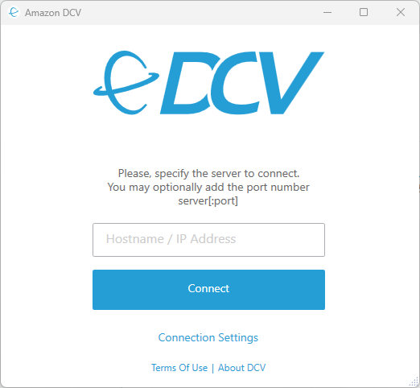

# CARLA Simulator Ubuntu 22.04 + NICE DCV + GPU

This [AWS CloudFormation](https://aws.amazon.com/cloudformation/) template will deploy [CARLA Simulator](https://carla.org/) into an accelerated computing instance running the [NICE DCV](https://aws.amazon.com/hpc/dcv/) server.


## CARLA

CARLA is an open-source simulator for autonomous driving research to support the development, training, and validation of autonomous driving systems.

## NICE DCV


NICE DCV is a high-performance remote display protocol that provides customers with a secure way to deliver remote desktops and application streaming from any cloud or data center to any device over varying network conditions.

For security reasons, the EC2 instance are located in a private subnet. Therefore, you will need to use the AWS systems manager with the [Session Manager plugin](https://docs.aws.amazon.com/systems-manager/latest/userguide/install-plugin-debian-and-ubuntu.html) to tunnel the DCV port to your local machine.

Once the tunnel is setup, the NICE DCV client can connect to the instance using ***localhost:8443***.

You will need to set the ***Connection Setting*** to be ***WebSockets/TCP*** instead of ***QUIC***.

###### NICE DCV with unicast

> Be aware that the unicast setup does not support UDP multicasting.

To use the simplified architecture without Transit Gateway, follow these steps:

1. Configure both the device simulator and CARLA for unicast when using ROS2.
1. Find the example configuration for `cyclonedds` at: `carla-client/ros2/cyclonedds_unicast.yaml`.
1. Before running the ROS2 example, set the `CYCLONEDDS_URI` environment variable with this command:
 
   ```
   export CYCLONEDDS_URI=carla-client/ros2/cyclonedds_unicast.yaml
   ```

1. using ***`template-unicast.yml`*** as a *CloudFormation* template instead of ***`template.yml`***

## Deployment instructions

### Prerequisites:

#### Session Manager plugin

For security reasons, you need to use the AWS systems manager with the [Session Manager plugin](https://docs.aws.amazon.com/systems-manager/latest/userguide/install-plugin-debian-and-ubuntu.html) to tunnel the DCV port to your local machine.

for detailed installation instruction, please follow: https://docs.aws.amazon.com/systems-manager/latest/userguide/install-plugin-debian-and-ubuntu.html

#### Get the Biga AMI ID

In order to create the current stack, you will need to reference the AMI id created in the [demo-iot-automotive-embeddedlinux-image](https://github.com/aws4embeddedlinux/demo-iot-automotive-embeddedlinux-image) project.

So, if haven't deployed it yet, please proceed with the deployment of the [demo-iot-automotive-embeddedlinux-image](https://github.com/aws4embeddedlinux/demo-iot-automotive-embeddedlinux-image) project.

Once you have deployed the [demo-iot-automotive-embeddedlinux-image](https://github.com/aws4embeddedlinux/demo-iot-automotive-embeddedlinux-image) project, you will need to retrieve the AMI created by the **`EC2AMIBigaPipeline`** stack pipeline.

You can access it in the console via the EC2 console AMI list using the following url after replacing the `<region>` token:

```
https://<region>>.console.aws.amazon.com/ec2/home?Images:visibility=owned-by-me&region=<region>#Images:visibility=owned-by-me
```

Alternatively, you can execute the following script to retrieve the latest Biga AMI id:

> Make sure to replace the `<STACK_NAME>` token if you changed the deployed stack name from [demo-iot-automotive-embeddedlinux-image](https://github.com/aws4embeddedlinux/demo-iot-automotive-embeddedlinux-image).

```
cat << 'EOF' > get-ami-id.sh
#!/bin/bash

STACK_NAME=EC2AMIBigaPipeline

s3_bucket_arn=$(aws cloudformation describe-stacks --stack-name ${STACK_NAME} --output text --query "Stacks[0].Outputs[?OutputKey=='BuildOutput'].OutputValue")
s3_bucket_name=${s3_bucket_arn##*:}
ami_file=$(aws s3api list-objects --bucket $s3_bucket_name --output text --query 'Contents[?starts_with(Key, `ami`) == `true`][Key,LastModified] | sort_by(@, &[1])[1:][0]')
ami_id=${ami_file%%.*}

echo -e "${ami_id}"
EOF
chmod +x get-ami-id.sh

echo -e "The Biga AMI ID is : $(./get-ami-id.sh)"
```

### Deploy the CloudFormation Stack

Download desired template file **[template.yml](template.yml)** (or **[template-unicast.yml](template-unicast.yml)**).

Login into the AWS [CloudFormation console](https://console.aws.amazon.com/cloudformation/home#/stacks/create/template). 

Choose **Create Stack** and **Upload** the template file.

Specify a **Stack name** like **`demo-iot-automotive-simulator`**


Specify the parameter values (all fields are required):

| Parameter Name       | Description | Default value |
|----------------------|-------------|---------------|
| **ImageId**          | [System Manager Parameter](https://aws.amazon.com/blogs/compute/using-system-manager-parameter-as-an-alias-for-ami-id/) path to AMI ID. | /aws/service/canonical/ubuntu/server/20.04/stable/current/amd64/hvm/ebs-gp2/ami-id
| **InstanceType**     | appropriate [instance type](https://docs.aws.amazon.com/AWSEC2/latest/UserGuide/instance-types.html). | g5.16xlarge | 
| **Ec2InstanceName**        | Name of the EC2 instance hosting the Carla Simulator. | Ubuntu-CARLA-NICE-DCV
| **Ec2InstanceVolumeType**  | EBS volume type. | gp3
| **Ec2InstanceVolumeSize**  | EBS volume size (in GB). | 40
| **BigaAmiId**              | AMI of the EC2 image for the Biga device as determined in [Get the Biga AMI ID](#get-the-biga-ami-id) | `to be provided`
| **BigaInstanceType** | Instance type of the Biga device. | t4g.micro
| **BigaInstanceName** | Name of the Biga device. | Biga
| **AllowedIP** | an IP address CIDR range that will be allow listed to access the Carla Simulator via a security group rule |  `to be provided`
| **CarlaVersion** | The carla simulator version to be installed | 0.9.13


Click on **Next** until you click **Submit** to launch your stack creation.

> It may take up to 60 minutes to provision the EC2 instance. 

After your stack has been successfully created, its status changes to **CREATE\_COMPLETE**. 

Now, go to the **Outputs** tab.


### Get the Carla Simulator user & password from AWS Secrets Manager

On the **Outputs** tab, locate the entry named **`CarlaSimulatorSecret`**.

### Access the Carla Simulator instance via AWS System Manager Session Manager

On the **Outputs** tab, locate the entry named **`SSMSessionManagerURL`** which contains the URL to log in via SSM Session Manager.

The URL should look like this : *`https://<region>.console.aws.amazon.com/systems-manager/session-manager/<instance id>`*

For more information, check the [AWS Systems Manager Session Manager](https://docs.aws.amazon.com/systems-manager/latest/userguide/session-manager.html) documentation.

### Access the Carla Simulator instance via Amazon DCV web browser client

The created stack will allow list your current IP address to connect into the resources associated with the public subnet and `BigaSecurityGroup` security group.

> If your IP address changes or you don't need to access the Carla Simulator instance, make sure to update the `BigaSecurityGroup` security group and update or remve the rule named `external access - tcp - 8443` & `external access - udp - 8443` .

On the **Outputs** tab, locate the entry named **`NICEDCVWebAccessConsoleURL`** which contains the URL to log in via SSM Session Manager.

The URL should look like this : *`https://<carla simulator pulic dns>:8443`*

For more information, check the [Amazon DCV Web browser client](https://docs.aws.amazon.com/dcv/latest/userguide/client-web.html) documentation.

### Access the Carla Simulator instance via Amazon DCV client

Install the Amazon DCV client of you current operating system from the [Amazon DCV Dowloads](https://www.amazondcv.com/latest.html) page.

Once installed, start the Amazon DCV client :



From the **Outputs** tab in the CloudFormation stack, locate the entry named **`NICEDCVClientConnectionString`** and paste it in the Amazon DCV client.

### Testing the PythonAPI

The best way to test the Python API is to drive a car. In order to do so, you will have to follow the steps below:

- Start the server "/opt/carla-simulator/CarlaUE4.sh -no-rendering -quality-level=Epic -prefernvidia" in different terminal

1. Activate the virtual environment created by the installation with the command ". venv/bin/activate" from the "ubuntu" user's home.
2. Navigate to the PythonAPI examples folder "cd /opt/carla-simulator/PythonAPI/examples".
3. Run "python manual\_control.py".

Here is the link to the complete [CARLA documentation](https://carla.readthedocs.io/en/0.9.13/)


## Testing vcan connection to biga ec2 device
Running this on the biga ec2 instance, connect via EC2 serial console. Stop after test - "ctrl-c".
```
candump vcan0
```

Running this on the Carla ec2 instance, in a terminal.

```
./multicast_can_send.sh
```

Running this on the Carla ec2 instance, in another terminal.


```
cansend vcan0 123#00FFAA5501020304
```

You should see this in the biga ec2 instance:

```
root@ip-10-0-1-93:~# candump vcan0
vcan0  123   [8]  00 FF AA 55 01 02 03 04

```

## Security

See [CONTRIBUTING](CONTRIBUTING.md#security-issue-notifications) for more information.

## License

This library is licensed under the MIT-0 License. See the LICENSE file.

## Credits

This AWS CloudFormation template has been made possible by using as a reference the [Amazon EC2 NICE DVC Samples](https://github.com/aws-samples/amazon-ec2-nice-dcv-samples).
