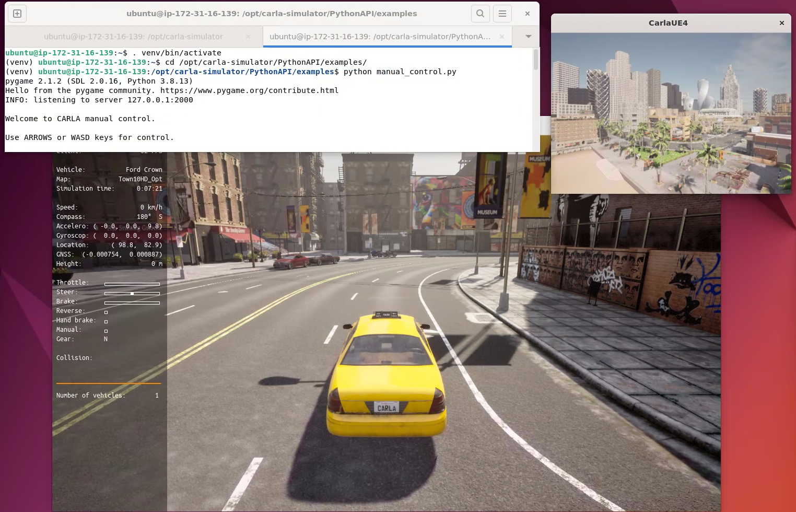

# CARLA Simulator Ubuntu 22.04 on physical hardware + Amazon DCV + GPU

You should execute these steps as `root` and expect that you will be using an `ubuntu` user. 

Once you completed the steps below, you will need to reboot for all the changes to take effect.

## Table of Contents

1. [Preparation](#preparation)
1. [APT Install Ubuntu packages](#apt-install-uUbuntu-packages )
1. [AWS CLI](#aws-cli)
1. [Prepare the target user environment](#prepare-the-target-user-environment)
1. [NVIDIA drivers](#nvidia-drivers)
1. [Amazon DCV](#amazon-dcv)
1. [CARLA Simulator](#carla-simulator)
1. [ROS2](#ros2)
1. [Socket CAN](#socket-can)
1. [Breeze](#breeze)
1. [CAN Interactive Generator (CANIGEN)](#can-interactive-generator---canigen)
1. [Firefox](#firefox)
1. [Cleanup & Reboot](#cleanup--reboot)
1. [Verify the setup](#verify-the-amazon-dcv-setup)


## Preparation

First you will need to set some environement variables and clone the Git repository:

Open a terminal as a **root** user and execute the following commands:


```sh
export CARLA_VERSION=0.9.13
export CARLA_OS_USER_NAME=biga
export SIMULATOR_CONFIG_DESTINATION=/opt/demo-iot-automotive-simulator/simulator-config
export STACK_REGION=eu-central-1
```

> [!NOTE]
>
> If you close this terminal, and open a new one, you will need to execute these commands again.
> 
> You might need to adjust the OSUserName depending on how you system is configured.
>

[Bask to the top](#table-of-contents)

## Clone the project

```bash

cd /opt
git clone https://github.com/adadouche/demo-iot-automotive-simulator.git
cd $SIMULATOR_CONFIG_DESTINATION
```

[Bask to the top](#table-of-contents)

## Install services files

In the same terminal as a **root** user, execute the following commands:

```sh
cd $SIMULATOR_CONFIG_DESTINATION/assets/commands
. 00-deploy-services.sh
```

[Bask to the top](#table-of-contents)

## Install Ubuntu packages

In the same terminal as a **root** user, execute the following commands:

```sh
cd $SIMULATOR_CONFIG_DESTINATION/assets/commands
. 01-apt-install.sh 
```

[Bask to the top](#table-of-contents)

## Install AWS components

In the same terminal as a **root** user, execute the following commands:

```sh
cd $SIMULATOR_CONFIG_DESTINATION/assets/commands
. 02-aws-install.sh
```

For more details about the AWS CLI installation, please check : https://docs.aws.amazon.com/cli/latest/userguide/getting-started-install.html

[Bask to the top](#table-of-contents)

## Create the OS user password using Secrets Manager 

In the same terminal as a **root** user, execute the following commands:

```sh
export CARLA_SECRET='my-secret-20'
PASSWORD=$(aws secretsmanager get-random-password \
    --password-length 32 \
    --exclude-characters "\`\'\"@/;,\$%<>^//" \
    --output text
)

cat <<EOF > $CARLA_SECRET.json
{"username": "${CARLA_OS_USER_NAME}", "password": "${PASSWORD}"}
EOF

aws secretsmanager create-secret \
    --name $CARLA_SECRET \
    --description "Simple secret created by AWS CDK for the Carla instance." \
    --secret-string file://$CARLA_SECRET.json
rm $CARLA_SECRET.json
```

## Prepare the target user environment 

In the same terminal as a **root** user, execute the following commands:

```sh
cd $SIMULATOR_CONFIG_DESTINATION/assets/commands
. 03-add-user.sh
```

[Bask to the top](#table-of-contents)

## Create a Python Virtual environment

In the same terminal as a **root** user, execute the following commands:

```sh
cd $SIMULATOR_CONFIG_DESTINATION/assets/commands
. 04-create-venv.sh
```

## NVIDIA drivers

In the same terminal as a **root** user, execute the following commands:

```sh
cd $SIMULATOR_CONFIG_DESTINATION/assets/commands
. 05-nvidia-install.sh
```

For more details about the NVIDIA drivers installation, please check : https://ubuntu.com/server/docs/nvidia-drivers-installation

[Bask to the top](#table-of-contents)

## Amazon DCV

For more details about the Amazon DCV installation, please check : https://docs.aws.amazon.com/dcv/latest/adminguide/setting-up.html

### Prerequisites 

In the same terminal as a **root** user, execute the following commands:

```sh
cd $SIMULATOR_CONFIG_DESTINATION/assets/commands
. 06-dcv-install-prerequisites.sh
```

### Installation

In the same terminal as a **root** user, execute the following commands:

```sh
cd $SIMULATOR_CONFIG_DESTINATION/assets/commands
. 07-dcv-install.sh
```

### Configuration

In the same terminal as a **root** user, execute the following commands:

```sh
cd $SIMULATOR_CONFIG_DESTINATION/assets/commands
. 08-dcv-configure.sh
```

[Bask to the top](#table-of-contents)

## CARLA Simulator

In the same terminal as a **root** user, execute the following commands:

```sh
cd $SIMULATOR_CONFIG_DESTINATION/assets/commands
. 09-carla-install.sh
```

[Bask to the top](#table-of-contents)

## ROS2

In the same terminal as a **root** user, execute the following commands:

```sh
cd $SIMULATOR_CONFIG_DESTINATION/assets/commands
. 10-ros2-install.sh
```

[Bask to the top](#table-of-contents)

## Socket CAN

In the same terminal as a **root** user, execute the following commands:

```sh
cd $SIMULATOR_CONFIG_DESTINATION/assets/commands
. 11-socketcan-install.sh
```

[Bask to the top](#table-of-contents)

## Breeze

In the same terminal as a **root** user, execute the following commands:

```sh
cd $SIMULATOR_CONFIG_DESTINATION/assets/commands
. 12-breeze-install.sh
```

[Bask to the top](#table-of-contents)

## CAN Interactive Generator - CANIGEN

In the same terminal as a **root** user, execute the following commands:

```sh
cd $SIMULATOR_CONFIG_DESTINATION/assets/commands
. 13-canigen-install.sh
```

[Bask to the top](#table-of-contents)

## Firefox

In the same terminal as a **root** user, execute the following commands:

```sh
cd $SIMULATOR_CONFIG_DESTINATION/assets/commands
. 14-firefox-install.sh
```

[Bask to the top](#table-of-contents)

## Cleanup & Reboot

In the same terminal as a **root** user, execute the following commands:

```sh
cd $SIMULATOR_CONFIG_DESTINATION/assets/commands
. 99-finalize-install.sh
```

[Bask to the top](#table-of-contents)

## Verify the Amazon DCV setup

You can verify that all Amazon DCV processes are running using the following command:

```sh
ps -edf | grep dcv
```

The outpout should look like the following:

```
dcv        57827       1  0 12:05 ?        00:00:00 /bin/bash /usr/bin/dcvserver -d --service
dcv        57828   57827  0 12:05 ?        00:00:01 /usr/lib/x86_64-linux-gnu/dcv/dcvserver --service
root       57833       1  0 12:05 ?        00:00:00 /bin/bash /opt/dcv-virtual-session.sh
root       57856       1  0 12:05 ?        00:00:00 /bin/bash /usr/bin/dcvsessionlauncher -d
root       57859   57856  0 12:05 ?        00:00:00 /usr/lib/x86_64-linux-gnu/dcv/dcvsessionlauncher
root       57863   57859  0 12:05 ?        00:00:00 /sbin/runuser -l -s /usr/lib/x86_64-linux-gnu/dcv/dcvbash -c /usr/lib/x86_64-linux-gnu/dcv/dcvsessionstarter -w XDG_SESSION_TYPE biga
biga       57884   57863  0 12:05 ?        00:00:00 bash /usr/lib/x86_64-linux-gnu/dcv/dcvsessionstarter
biga       57914   57884  0 12:05 ?        00:00:00 /usr/bin/Xdcv -sessionid demo -auth /run/user/1001/dcv/demo.xauth -displayfd 4 -logfile /var/log/dcv/Xdcv.biga.demo.log -output 800x600+0+0 -output 800x600+800+0 -output 800x600+1600+0 -output 800x600+2400+0 -enabledoutputs 1 -logverbose 3 -dpi 96 -nolisten tcp
biga       57926   57884  0 12:05 ?        00:00:03 /usr/lib/x86_64-linux-gnu/dcv/dcvagent --mode full --session-id demo --display :1 --settings-path /etc/dcv/dcv.conf --log-level info --log-dir /var/log/dcv --log-rotate-at-startup
biga       57933   57884  0 12:05 ?        00:00:00 /bin/sh /etc/dcv/dcvsessioninit demo
ssm-user   70918   11085  0 12:11 pts/1    00:00:00 grep dcv
```

You can also execute the following command to verify that a DCV sessions has been created (as a root user):

```sh
dcv list-sessions
```

The outpout should look like the following:

```
Session: 'demo' (owner:biga type:virtual)
```

## Run the CARLA Simulator with manual control

> The Amazon DCV solution doesn't allow USB remotization for the **Logitech G29** and **Logitech G923** device  

In a new terminal as your target user (`biga`), execute the following commands:

```sh
source ~/.venv-carla/bin/activate
/opt/carla-simulator/CarlaUE4.sh -no-rendering -quality-level=Epic -prefernvidia
```

In a new terminal as your target user, execute the following commands:

```sh
source ~/.venv-carla/bin/activate
cd /opt/carla-simulator/PythonAPI/examples
python manual_control.py
```



You can use the arrow to control the car.

## Run the CARLA Simulator with a steering wheel

The **Logitech G29** and **Logitech G923** steering were tested and are curruntly working.

There is no additional isntallation required for the **Logitech G29**.

For the **Logitech G923**, you will need to install the **lg4ff** drivers.

In a terminal as the root user, execute the following commands:

```sh
apt install libcanberra-gtk-module libcanberra-gtk3-module jstest-gtk 
mkdir -p /usr/src/new-lg4ff
git clone https://github.com/berarma/new-lg4ff.git /usr/src/new-lg4ff
dkms install /usr/src/new-lg4ff
update-initramfs -u
```

Now, you need to reboot for the change to take effect.

Open a terminal as your target user and execute the following command:

```sh
jstest-gtk 
```

Steer the wheel and press the braks, and you should see the gauge moving for your **Logitech G923** device.

